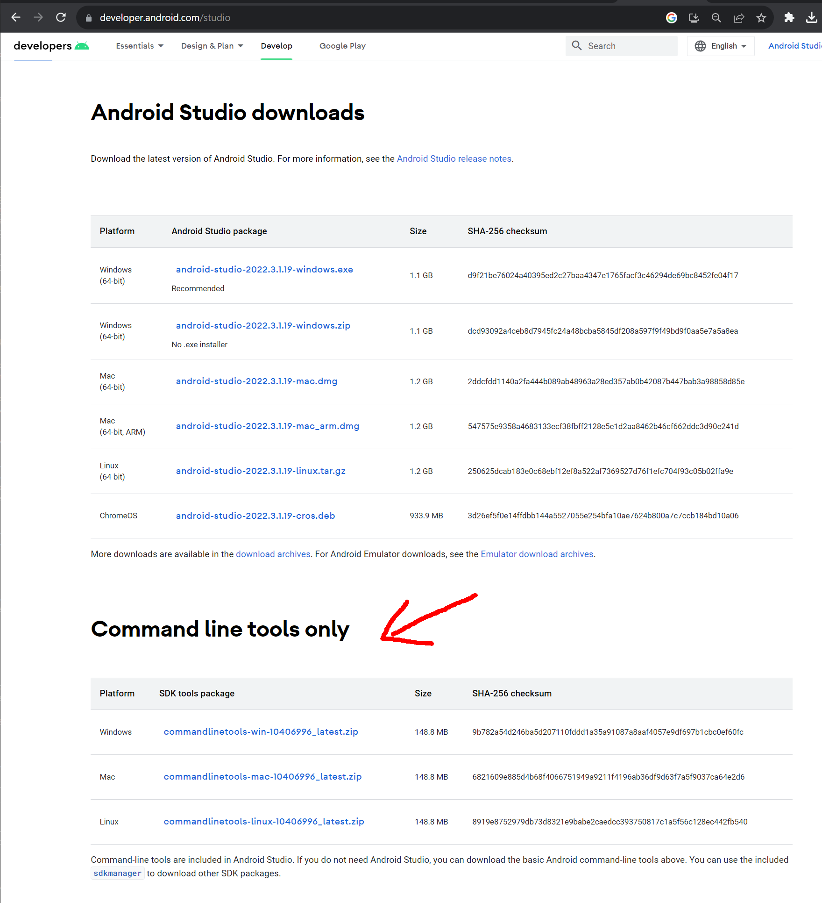
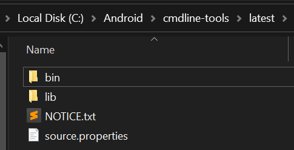

# BARE APK

Example of how to build an Android apk in C from scratch.

- No need for Android Studio.
- No complicated build systems such as gradle.
- Use rudimentary cmd line tools: understand the very basics.
- How to run the apk through USB using adb.
- The build and run process is contained in a small python file: `make.py`
- Not using the android NDK [glue code](https://android.googlesource.com/platform/development/+/4948c163663ecc343c97e4c2a2139234f1d3273f/ndk/sources/android/native_app_glue).

## JDK

Even if our app will be written in C, we need to install the JDK (Java Development Kit).

Download it from [here](https://www.oracle.com/es/java/technologies/downloads/) and then install it.

## Download Android developer command line tools

Create an `Android` folder anywhere it's convenient for you (e.g: C:/Android/ or /home/user/Android). This is where all all the Android development files will reside.

Inside the `Android/` directory create another folder called `cmdline-tools`

Download the SDK cmd line tools from the official android page.
You don't need to download Android Studio; "Command line tools only".


Unzip the .zip file inside the `cmdline-tools` folder we just created. After decompression you will find another folder called `cmdline-tools`too. Rename the inner folder to `latest`. You should see this directory structure:



The downloaded package contains a very small set of tools to get you started.

## sdkmanager

The `sdkmanger` cmd line tool can be used in order to download individual components such as the SDK, the NDK, and other utilities.

In order to see the things that you can install:

```
C:/Android/cmdline-tools/latest/sdkmanager --list
```

If you want to see which ones you have installed already:

```
C:/Android/cmdline-tools/latest/sdkmanager --list_installed
```

You will want to install the latest build tools (at the time of writing, the latest version is 34.0.0 rc3):

```
C:/Android/cmdline-tools/latest/sdkmanager "build-tools;34.0.0-rc3"
```

Install the latest NDK:
```
C:/Android/cmdline-tools/latest/sdkmanager "ndk;25.2.9519653"
```

Install the SDK Platform for the **minimum** Android version you want to support. Let's say we want to support any API newer than version 21 (Android 5):

```
C:/Android/cmdline-tools/latest/sdkmanager "platforms;android-21"
```

You can see the correspondence of Android versions and API version [here](https://apilevels.com/), along with the maket shares. I think API 21 is a good choice if you want your app to run in older devices.

The `platform-tools` package contains ADB (Android Debug Bridge). ADB is a very versatile command line tool. It allows us to do different things such as: installing the apk into our phone through USB or wifi, launching the app remotely, reading the logs generated by our app, or even start a debugging session. Install it with:

```
C:/Android/cmdline-tools/latest/sdkmanager "platform-tools"
```

## Create a key for singing the .apk

The Android OS requires all .apks to be signed.

In order to generate our signing key we use `keytool` provided in the JDK.

```
& "C:\Program Files\Java\jdk-20\bin\keytool.exe" -genkey -keystore test.keystore -storepass android -alias test -keyalg RSA -keysize 2048 -validity 50000
```

This signing key only needs to be generated once. You shouldn't delete this key. If you lost your key, and generate a new one, when reinstalling the same app, the OS will detect that the signature has changed, thus will reject it.

Links to learn more about APK signing:
- https://developer.android.com/studio/publish/app-signing
- https://www.youtube.com/watch?v=XzAZq_LPFUU
- https://www.youtube.com/watch?v=odv_1fxt9BI

## Configure the script

At the top of `make.py` you will find some variables you can configure:

```python
APP_NAME = "test"
ANDROID_MIN_VERSION = 21
ANDROID_TARGET_VERSION = 33
SDK_PATH = "C:/Android"
JDK_PATH = "C:/Program Files/Java/jdk-20"
```

You should set `SDK_PATH` and `JDK_PATH` directories to whereever you have them in your system.

`APP_NAME` is the name of your application. A compile flag is passed to the compiler to create a `#define APP_NAME <APP_NAME>`.

There are two different SDK version numbers you need to define:
- `ANDROID_MIN_VERSION` is the minimum version that your app supports. If you have an older android OS, you won't be able to install the app.
- `ANDROID_TARGET_VERSION` is the latest version that your app is designed to work with. It is NOT the maximum version. With the target version, you are saying "this is the latest Android version I have tested, and it works fine". Newer Android OS versions might take the target version into consideration for making internal compatbility adjustments, but you don't need to worry about this: it should just work. You should set target version to the latest Android version that is available at the time (and make sure to test it using a modern device or emulator).

You can read more about the difference between these two versions here: https://stackoverflow.com/questions/24510219/what-is-the-difference-between-min-sdk-version-target-sdk-version-vs-compile-sd

Another thing you can configure in the script is the ARM architecture.

```python
arch = "arm32"
#arch = "arm64"
```

You can comment/uncomment these two lines to select between 32-bit ARM and 64-bit ARM instruction sets.

## AndroidManifest.xml

In the manifest file you also need to configure the minimum and target versions.

## Running the script

In order to build the .apk, just call:

```
python3 make.py
```

Build the .apk & install it in you device (should be connected through USB):

```
python3 make.py install
```

Build the .apk & install it & launch it:

```
python3 make.py run
```

## 

## Links

- https://github.com/cnlohr/rawdrawandroid
- https://hero.handmade.network/forums/code-discussion/t/3016-guide_-_how_to_build_a_native_android_app_using_a_single_batch_file_for_visual_studio
- https://stackoverflow.com/questions/50705658/how-to-sign-an-apk-through-command-line
- https://stackoverflow.com/questions/10930331/how-to-sign-an-already-compiled-apk
- https://stackoverflow.com/questions/39091845/create-android-apk-manually-via-command-line-makefile
- https://connortumbleson.com/2018/02/19/taking-a-look-at-aapt2/
- https://medium.com/mindorks/how-i-decreased-my-app-size-to-70-using-apk-analyser-4a6f79512072
- https://developer.android.com/ndk/samples/sample_na.html
- http://java-decompiler.github.io/
